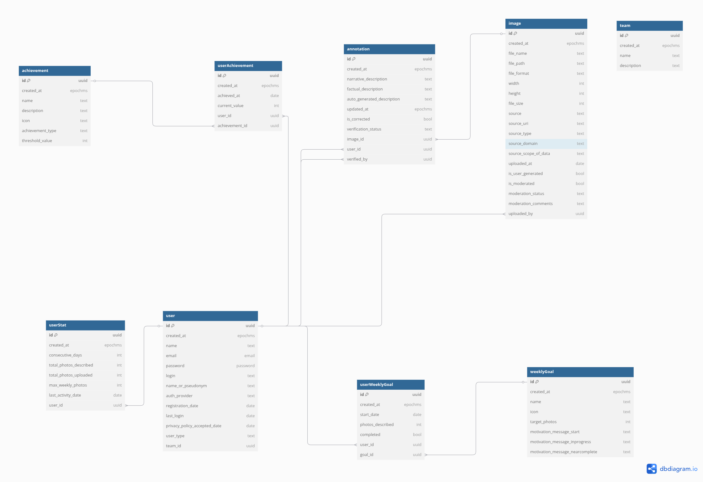

# Schemat bazy danych projektu Obywatel BIELIK

Niniejszy dokument zawiera szczegółowy opis schematu bazy danych dla projektu Obywatel BIELIK, aplikacji służącej do gromadzenia opisów zdjęć (anotacji) przez społeczność.

## Diagram ERD

## Opis tabel

### USERS

Tabela przechowująca informacje o użytkownikach systemu.

| Kolumna | Typ | Opis |
|---------|-----|------|
| `id` | UUID | Unikalny identyfikator użytkownika (klucz główny) |
| `login` | VARCHAR(50) | Unikalny login użytkownika |
| `name_or_pseudonym` | VARCHAR(100) | Imię lub pseudonim użytkownika (opcjonalne) |
| `auth_provider` | ENUM | Dostawca uwierzytelniania ('Google', 'Facebook', 'Apple') |
| `email` | VARCHAR(100) | Adres email użytkownika |
| `registration_date` | DATETIME | Data rejestracji użytkownika |
| `last_login` | DATETIME | Data ostatniego logowania |
| `privacy_policy_accepted_date` | DATETIME | Data akceptacji polityki prywatności |
| `user_type` | ENUM | Typ użytkownika ('Anotator', 'Koordynator', 'Administrator', 'Recenzent') |
| `team_id` | UUID | Identyfikator zespołu, do którego należy użytkownik (klucz obcy) |

### TEAMS

Tabela przechowująca informacje o zespołach, do których mogą należeć użytkownicy.

| Kolumna | Typ | Opis |
|---------|-----|------|
| `id` | UUID | Unikalny identyfikator zespołu (klucz główny) |
| `name` | VARCHAR(100) | Nazwa zespołu |
| `description` | TEXT | Opis zespołu |
| `created_at` | DATETIME | Data utworzenia zespołu |

### WEEKLY_GOALS

Tabela przechowująca definicje celów tygodniowych dostępnych dla użytkowników.

| Kolumna | Typ | Opis |
|---------|-----|------|
| `id` | UUID | Unikalny identyfikator celu (klucz główny) |
| `name` | VARCHAR(100) | Nazwa celu tygodniowego |
| `icon` | VARCHAR(50) | Nazwa ikony przypisanej do celu |
| `target_photos` | INT | Liczba zdjęć do opisania w ramach celu |
| `motivation_message_start` | VARCHAR(200) | Wiadomość motywacyjna wyświetlana na początku |
| `motivation_message_inprogress` | VARCHAR(200) | Wiadomość motywacyjna wyświetlana w trakcie realizacji |
| `motivation_message_nearcomplete` | VARCHAR(200) | Wiadomość motywacyjna wyświetlana przed zakończeniem |

### USER_WEEKLY_GOALS

Tabela łącząca użytkowników z wybranymi przez nich celami tygodniowymi.

| Kolumna | Typ | Opis |
|---------|-----|------|
| `id` | UUID | Unikalny identyfikator (klucz główny) |
| `user_id` | UUID | Identyfikator użytkownika (klucz obcy) |
| `goal_id` | UUID | Identyfikator celu tygodniowego (klucz obcy) |
| `start_date` | DATETIME | Data rozpoczęcia realizacji celu |
| `photos_described` | INT | Liczba opisanych zdjęć w ramach celu |
| `completed` | BOOLEAN | Flaga oznaczająca czy cel został osiągnięty |

### IMAGES

Tabela przechowująca informacje o zdjęciach dostępnych w systemie.

| Kolumna | Typ | Opis |
|---------|-----|------|
| `id` | UUID | Unikalny identyfikator zdjęcia (klucz główny) |
| `file_name` | VARCHAR(100) | Nazwa pliku zdjęcia |
| `file_path` | VARCHAR(255) | Ścieżka do pliku w systemie |
| `file_format` | ENUM | Format pliku ('jpg', 'jpeg', 'png') |
| `width` | INT | Szerokość zdjęcia w pikselach |
| `height` | INT | Wysokość zdjęcia w pikselach |
| `file_size` | INT | Rozmiar pliku w bajtach |
| `source` | VARCHAR(100) | Źródło zdjęcia (np. 'NAC', 'Użytkownik') |
| `source_uri` | VARCHAR(255) | URI źródła (opcjonalne) |
| `source_type` | VARCHAR(50) | Typ źródła (opcjonalne) |
| `source_domain` | VARCHAR(100) | Domena źródła (opcjonalne) |
| `source_scope_of_data` | VARCHAR(100) | Zakres danych źródłowych (opcjonalne) |
| `uploaded_at` | DATETIME | Data przesłania zdjęcia |
| `uploaded_by` | UUID | Identyfikator użytkownika, który przesłał zdjęcie (klucz obcy) |
| `is_user_generated` | BOOLEAN | Czy zdjęcie zostało dodane przez użytkownika |
| `is_moderated` | BOOLEAN | Czy zdjęcie zostało zmoderowane |
| `moderation_status` | ENUM | Status moderacji ('approved', 'rejected', 'pending') |
| `moderation_comments` | TEXT | Komentarze moderacyjne (opcjonalne) |

### ANNOTATIONS

Tabela przechowująca opisy (anotacje) zdjęć.

| Kolumna | Typ | Opis |
|---------|-----|------|
| `id` | UUID | Unikalny identyfikator anotacji (klucz główny) |
| `image_id` | UUID | Identyfikator zdjęcia (klucz obcy) |
| `user_id` | UUID | Identyfikator użytkownika, który utworzył anotację (klucz obcy) |
| `narrative_description` | TEXT | Opis narracyjny zdjęcia |
| `factual_description` | TEXT | Opis faktograficzny zdjęcia (opcjonalny) |
| `auto_generated_description` | TEXT | Automatycznie wygenerowany opis |
| `created_at` | DATETIME | Data utworzenia anotacji |
| `updated_at` | DATETIME | Data ostatniej aktualizacji anotacji |
| `is_corrected` | BOOLEAN | Czy opis został skorygowany |
| `verification_status` | ENUM | Status weryfikacji ('verified', 'rejected', 'pending') |
| `verified_by` | UUID | Identyfikator użytkownika, który zweryfikował anotację (klucz obcy) |

### ACHIEVEMENTS

Tabela przechowująca definicje osiągnięć dostępnych w systemie.

| Kolumna | Typ | Opis |
|---------|-----|------|
| `id` | UUID | Unikalny identyfikator osiągnięcia (klucz główny) |
| `name` | VARCHAR(100) | Nazwa osiągnięcia |
| `description` | VARCHAR(255) | Opis osiągnięcia |
| `icon` | VARCHAR(50) | Nazwa ikony przypisanej do osiągnięcia |
| `achievement_type` | ENUM | Typ osiągnięcia ('consecutive_days', 'photos_described', 'photos_uploaded', 'weekly_record') |
| `threshold_value` | INT | Wartość progowa dla osiągnięcia |

### USER_ACHIEVEMENTS

Tabela łącząca użytkowników z osiągnięciami, które zdobyli.

| Kolumna | Typ | Opis |
|---------|-----|------|
| `id` | UUID | Unikalny identyfikator (klucz główny) |
| `user_id` | UUID | Identyfikator użytkownika (klucz obcy) |
| `achievement_id` | UUID | Identyfikator osiągnięcia (klucz obcy) |
| `achieved_at` | DATETIME | Data zdobycia osiągnięcia |
| `current_value` | INT | Aktualna wartość postępu |

### USER_STATS

Tabela przechowująca statystyki użytkowników.

| Kolumna | Typ | Opis |
|---------|-----|------|
| `id` | UUID | Unikalny identyfikator (klucz główny) |
| `user_id` | UUID | Identyfikator użytkownika (klucz obcy) |
| `consecutive_days` | INT | Liczba dni z rzędu korzystania z aplikacji |
| `total_photos_described` | INT | Całkowita liczba opisanych zdjęć |
| `total_photos_uploaded` | INT | Całkowita liczba przesłanych zdjęć |
| `max_weekly_photos` | INT | Rekord w liczbie opisanych zdjęć w tygodniu |
| `last_activity_date` | DATETIME | Data ostatniej aktywności |

## Relacje

### Relacje jeden-do-wielu

1. **TEAMS → USERS**: Jeden zespół może mieć wielu użytkowników.
   - Klucz obcy: `USERS.team_id` → `TEAMS.id`

2. **USERS → IMAGES**: Jeden użytkownik może przesłać wiele zdjęć.
   - Klucz obcy: `IMAGES.uploaded_by` → `USERS.id`

3. **USERS → ANNOTATIONS**: Jeden użytkownik może utworzyć wiele anotacji.
   - Klucz obcy: `ANNOTATIONS.user_id` → `USERS.id`

4. **USERS → ANNOTATIONS** (weryfikacja): Jeden użytkownik może zweryfikować wiele anotacji.
   - Klucz obcy: `ANNOTATIONS.verified_by` → `USERS.id`

5. **IMAGES → ANNOTATIONS**: Jedno zdjęcie może mieć wiele anotacji (od różnych użytkowników).
   - Klucz obcy: `ANNOTATIONS.image_id` → `IMAGES.id`

6. **USERS → USER_STATS**: Jeden użytkownik ma jeden rekord statystyk.
   - Klucz obcy: `USER_STATS.user_id` → `USERS.id`

### Relacje wiele-do-wielu

1. **USERS ↔ WEEKLY_GOALS**: Realizowane przez tabelę pośrednią `USER_WEEKLY_GOALS`.
   - Klucz obcy: `USER_WEEKLY_GOALS.user_id` → `USERS.id`
   - Klucz obcy: `USER_WEEKLY_GOALS.goal_id` → `WEEKLY_GOALS.id`

2. **USERS ↔ ACHIEVEMENTS**: Realizowane przez tabelę pośrednią `USER_ACHIEVEMENTS`.
   - Klucz obcy: `USER_ACHIEVEMENTS.user_id` → `USERS.id`
   - Klucz obcy: `USER_ACHIEVEMENTS.achievement_id` → `ACHIEVEMENTS.id`

## Indeksy

Poza kluczami głównymi i obcymi, zalecane jest utworzenie następujących indeksów dla optymalizacji wydajności:

1. `USERS` - indeks na `login` i `email` (dla szybkiego wyszukiwania podczas logowania)
2. `IMAGES` - indeks na `uploaded_at` (dla szybkiego wyszukiwania najnowszych zdjęć)
3. `IMAGES` - indeks na `moderation_status` (dla szybkiego filtrowania)
4. `ANNOTATIONS` - indeks na `created_at` (dla szybkiego wyszukiwania najnowszych anotacji)
5. `ANNOTATIONS` - indeks na `verification_status` (dla szybkiego filtrowania)
6. `USER_ACHIEVEMENTS` - indeks na `achieved_at` (dla szybkiego wyszukiwania najnowszych osiągnięć)
7. `USER_STATS` - indeks na `last_activity_date` (dla szybkiego wyszukiwania aktywnych użytkowników)

## Ograniczenia integralności

1. Wartości `USERS.login` i `USERS.email` muszą być unikalne.
2. Wartość `TEAMS.name` musi być unikalna.
3. Wartości `ANNOTATIONS.created_at` muszą być wcześniejsze lub równe `ANNOTATIONS.updated_at`.
4. Wartość `USER_STATS.consecutive_days` nie może być ujemna.
5. Wartość `USER_STATS.total_photos_described` nie może być ujemna.
6. Wartość `USER_STATS.total_photos_uploaded` nie może być ujemna.
7. Wartość `USER_STATS.max_weekly_photos` nie może być ujemna.
8. Wartość `IMAGES.width` musi być dodatnia.
9. Wartość `IMAGES.height` musi być dodatnia.
10. Wartość `IMAGES.file_size` musi być dodatnia.

## Wartości domyślne

1. `IMAGES.moderation_status` = 'pending' (domyślnie zdjęcia czekają na moderację)
2. `ANNOTATIONS.verification_status` = 'pending' (domyślnie anotacje czekają na weryfikację)
3. `IMAGES.is_moderated` = FALSE (domyślnie zdjęcia nie są zmoderowane)
4. `ANNOTATIONS.is_corrected` = FALSE (domyślnie opisy nie są skorygowane)
5. `USER_WEEKLY_GOALS.completed` = FALSE (domyślnie cele nie są ukończone)

## Uwagi implementacyjne

1. **Obsługa UUID**: Zaleca się używanie UUID w wersji 4 (losowe) dla wszystkich kluczy głównych.
2. **Usuwanie danych**: Zaleca się implementację usuwania danych w sposób bezpieczny, wykorzystując kaskadowe usuwanie lub oznaczanie rekordów jako usunięte.
3. **Migracje**: Należy stosować narzędzia do migracji (np. Alembic), aby umożliwić bezpieczną ewolucję schematu bazy danych.
4. **Transakcje**: Operacje, które modyfikują wiele powiązanych rekordów (np. dodawanie anotacji i aktualizacja statystyk użytkownika), powinny być wykonywane w ramach jednej transakcji.
